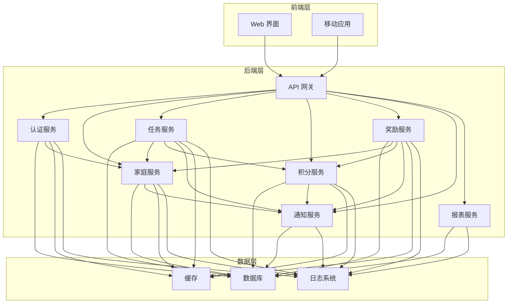
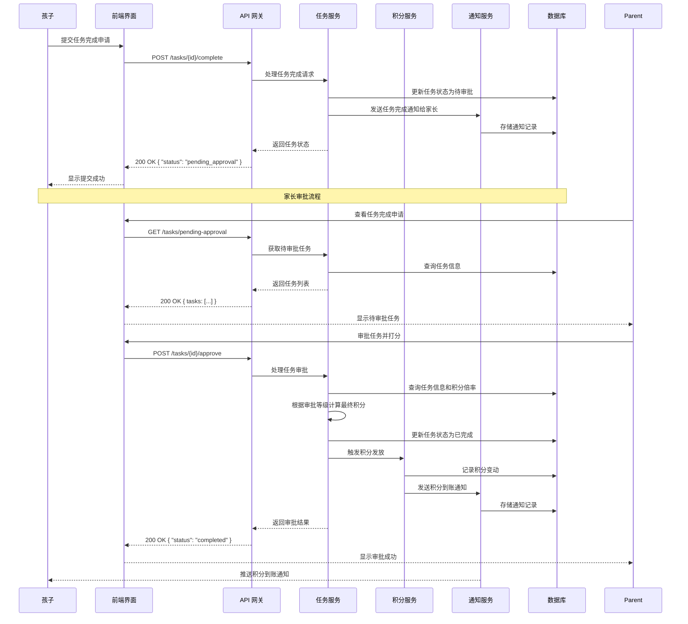
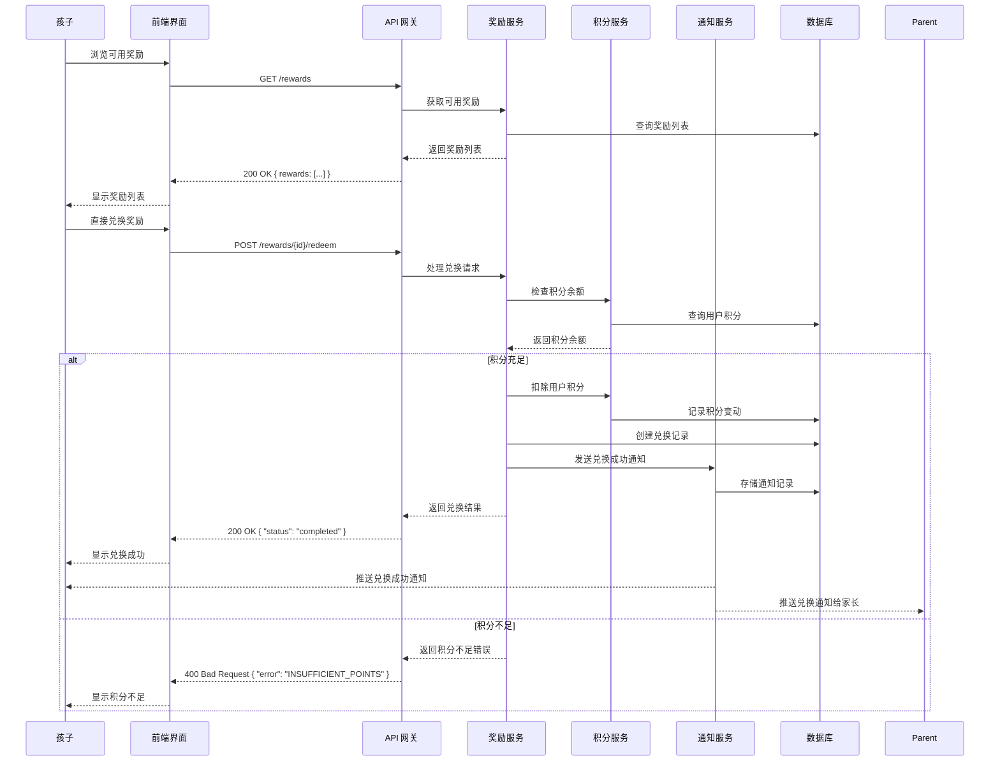

# ZClub 积分系统架构设计

## 1. 整体架构

## 2. 架构说明

### 2.1 前端层
- **Web 界面**：基于现代前端框架（如 React、Vue）构建的响应式 Web 应用，支持家长和孩子使用
- **移动应用**：可选的移动端应用，提供更便捷的使用体验

### 2.2 后端层
- **API 网关**：统一的 API 入口，处理请求路由、认证授权、请求限流等
- **认证服务**：处理用户登录、注册、权限管理等
- **家庭服务**：管理家庭信息、家庭成员关系、多家长权限等
- **任务服务**：管理任务的创建、分配、状态更新等
- **积分服务**：处理积分的发放、扣除、查询等
- **奖励服务**：管理奖励的创建、兑换、库存等
- **通知服务**：处理系统通知的发送和管理
- **报表服务**：生成积分统计、任务完成情况等报表

### 2.3 数据层
- **数据库**：存储用户、任务、积分、奖励等核心数据
- **缓存**：提高系统性能，缓存热点数据
- **日志系统**：记录系统运行日志和审计日志

## 3. 技术选型

### 3.1 前端技术
- **框架**：Vue
- **状态管理**：Vuex
- **UI 库**：Element Plus
- **响应式设计**：Tailwind CSS

### 3.2 后端技术
- **语言**：Java
- **框架**：Spring Boot
- **认证**：JWT
- **数据库**：MySQL
- **缓存**：Redis
- **日志**：Logback

### 3.3 部署方案
- **容器化**：Docker
- **编排**：Docker Compose
- **环境**：本地部署 / 云服务

## 4. 核心流程

### 4.1 任务完成流程

### 4.2 奖励兑换流程

## 5. 系统模块

### 5.1 认证模块
- 用户注册和登录
- 角色管理（管理员/家长/孩子）
- 权限控制
- 会话管理

### 5.2 家庭模块
- 家庭创建和管理
- 家长邀请和管理
- 家庭成员关系管理
- 家庭权限设置

### 5.3 任务模块
- 任务创建和编辑
- 任务分配
- 任务状态管理
- 任务历史记录

### 5.4 积分模块
- 积分发放
- 积分扣除
- 积分查询
- 积分历史记录

### 5.5 奖励模块
- 奖励创建和编辑
- 奖励库存管理
- 奖励兑换
- 兑换历史记录

### 5.6 通知模块
- 通知发送
- 通知管理
- 通知历史记录

### 5.7 报表模块
- 积分统计
- 任务完成统计
- 趋势分析
- 导出功能

## 6. 扩展性考虑

### 6.1 功能扩展
- 多家长支持
- 任务模板库
- 积分排行榜
- 成就系统
- 与智能家居设备集成

### 6.2 技术扩展
- 微服务架构
- 消息队列
- 分布式缓存
- 弹性伸缩

## 7. 安全考虑

### 7.1 数据安全
- 数据加密存储
- 密码加盐哈希
- 敏感操作二次验证

### 7.2 访问控制
- 基于角色的权限控制
- API 访问限流
- 防 SQL 注入
- 防 XSS 攻击

### 7.3 审计日志
- 记录关键操作
- 异常行为检测
- 日志分析

## 8. 监控与维护

### 8.1 系统监控
- 性能指标监控
- 错误率监控
- 系统健康检查

### 8.2 日志管理
- 结构化日志
- 日志聚合
- 日志分析

### 8.3 备份与恢复
- 定期数据备份
- 灾难恢复计划
- 数据迁移工具
