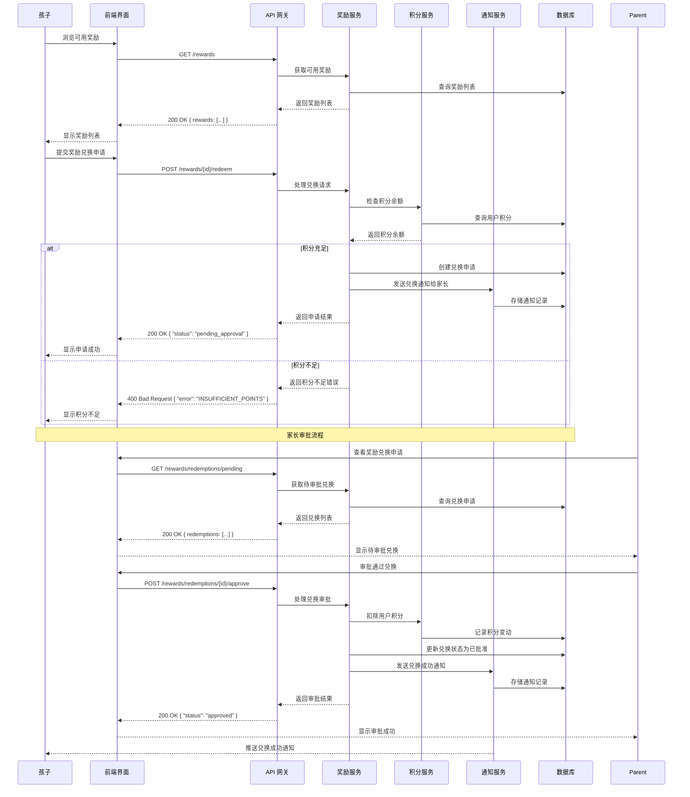

# 奖励兑换流程时序图

```mermaid
sequenceDiagram
    participant Child as 孩子
    participant UI as 前端界面
    participant API as API 网关
    participant RewardService as 奖励服务
    participant PointService as 积分服务
    participant NotificationService as 通知服务
    participant DB as 数据库

    Child->>UI: 浏览可用奖励
    UI->>API: GET /rewards
    API->>RewardService: 获取可用奖励
    RewardService->>DB: 查询奖励列表
    RewardService-->>API: 返回奖励列表
    API-->>UI: 200 OK { rewards: [...] }
    UI-->>Child: 显示奖励列表

    Child->>UI: 提交奖励兑换申请
    UI->>API: POST /rewards/{id}/redeem
    API->>RewardService: 处理兑换请求
    RewardService->>PointService: 检查积分余额
    PointService->>DB: 查询用户积分
    PointService-->>RewardService: 返回积分余额
    
    alt 积分充足
        RewardService->>DB: 创建兑换申请
        RewardService->>NotificationService: 发送兑换通知给家长
        NotificationService->>DB: 存储通知记录
        RewardService-->>API: 返回申请结果
        API-->>UI: 200 OK { "status": "pending_approval" }
        UI-->>Child: 显示申请成功
    else 积分不足
        RewardService-->>API: 返回积分不足错误
        API-->>UI: 400 Bad Request { "error": "INSUFFICIENT_POINTS" }
        UI-->>Child: 显示积分不足
    end

    Note over Child,DB: 家长审批流程
    Parent->>UI: 查看奖励兑换申请
    UI->>API: GET /rewards/redemptions/pending
    API->>RewardService: 获取待审批兑换
    RewardService->>DB: 查询兑换申请
    RewardService-->>API: 返回兑换列表
    API-->>UI: 200 OK { redemptions: [...] }
    UI-->>Parent: 显示待审批兑换

    Parent->>UI: 审批通过兑换
    UI->>API: POST /rewards/redemptions/{id}/approve
    API->>RewardService: 处理兑换审批
    RewardService->>PointService: 扣除用户积分
    PointService->>DB: 记录积分变动
    RewardService->>DB: 更新兑换状态为已批准
    RewardService->>NotificationService: 发送兑换成功通知
    NotificationService->>DB: 存储通知记录
    RewardService-->>API: 返回审批结果
    API-->>UI: 200 OK { "status": "approved" }
    UI-->>Parent: 显示审批成功
    NotificationService-->>Child: 推送兑换成功通知
```
