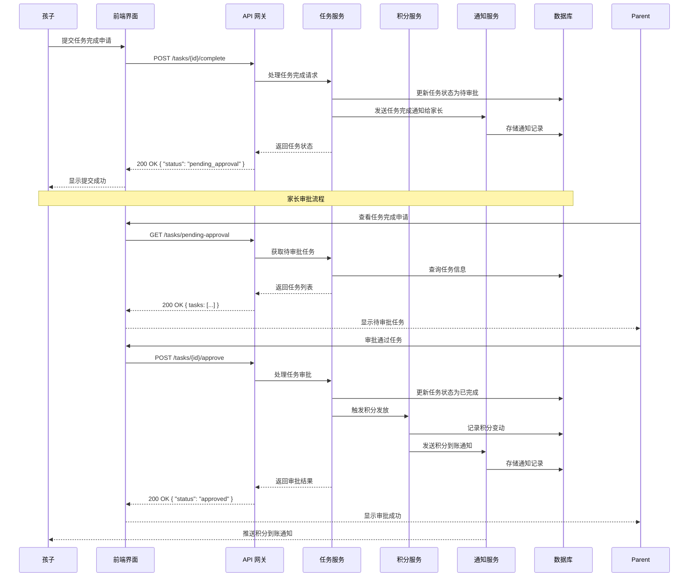

# 任务完成流程时序图

```mermaid
sequenceDiagram
    participant Child as 孩子
    participant UI as 前端界面
    participant API as API 网关
    participant TaskService as 任务服务
    participant PointService as 积分服务
    participant NotificationService as 通知服务
    participant DB as 数据库

    Child->>UI: 提交任务完成申请
    UI->>API: POST /tasks/{id}/complete
    API->>TaskService: 处理任务完成请求
    TaskService->>DB: 更新任务状态为待审批
    TaskService->>NotificationService: 发送任务完成通知给家长
    NotificationService->>DB: 存储通知记录
    TaskService-->>API: 返回任务状态
    API-->>UI: 200 OK { "status": "pending_approval" }
    UI-->>Child: 显示提交成功

    Note over Child,DB: 家长审批流程
    Parent->>UI: 查看任务完成申请
    UI->>API: GET /tasks/pending-approval
    API->>TaskService: 获取待审批任务
    TaskService->>DB: 查询任务信息
    TaskService-->>API: 返回任务列表
    API-->>UI: 200 OK { tasks: [...] }
    UI-->>Parent: 显示待审批任务

    Parent->>UI: 审批通过任务
    UI->>API: POST /tasks/{id}/approve
    API->>TaskService: 处理任务审批
    TaskService->>DB: 更新任务状态为已完成
    TaskService->>PointService: 触发积分发放
    PointService->>DB: 记录积分变动
    PointService->>NotificationService: 发送积分到账通知
    NotificationService->>DB: 存储通知记录
    TaskService-->>API: 返回审批结果
    API-->>UI: 200 OK { "status": "approved" }
    UI-->>Parent: 显示审批成功
    NotificationService-->>Child: 推送积分到账通知
```
