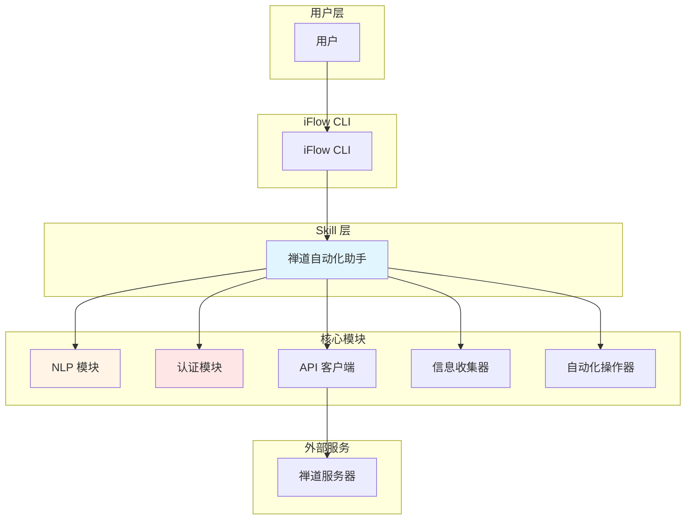
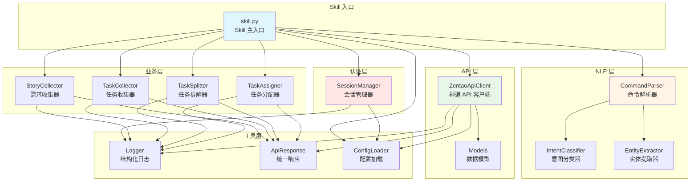
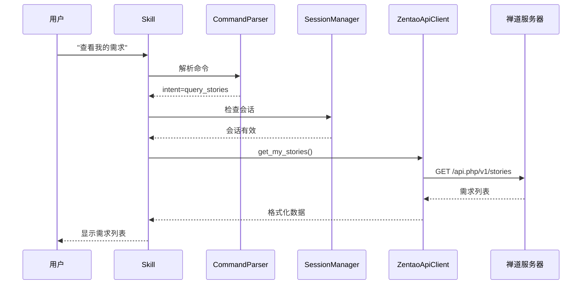
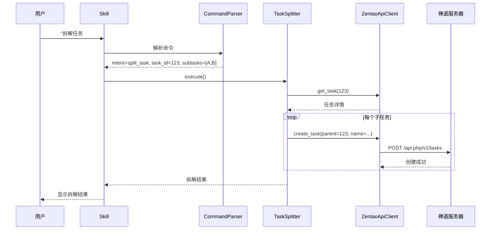

# 技术架构文档

## 1. 系统架构概览

ZTools 采用 **Skill-based Architecture**（基于技能的架构），通过 iFlow Skill 机制提供模块化的自动化工具。



## 2. 技术栈

### 2.1 核心技术

| 层级 | 技术 | 版本 | 用途 |
|------|------|------|------|
| 语言 | Python | 3.13+ | 主要开发语言 |
| HTTP 客户端 | requests | 2.31+ | API 调用 |
| 配置管理 | PyYAML | 6.0+ | 配置文件解析 |
| 加密存储 | cryptography | 41.0+ | 会话加密 |
| 系统密钥环 | keyring | 24.0+ | 安全存储密钥 |

### 2.2 架构原则

1. **文档即真理**：代码只是文档的可执行版本
2. **上下文优先**：充分理解业务上下文后再编码
3. **防御性编程**：假设第三方服务不稳定
4. **防腐层设计**：统一转换外部 API 数据
5. **插件化扩展**：便于添加新功能

## 3. 模块设计

### 3.1 禅道自动化助手架构



### 3.2 核心模块说明

#### 3.2.1 NLP 模块
- **IntentClassifier**：基于关键词匹配的意图分类，预留 LLM API 扩展接口
- **EntityExtractor**：提取任务ID、用户名、子任务名称等实体
- **CommandParser**：组合意图和实体，生成结构化命令

#### 3.2.2 认证模块
- **SessionManager**：使用系统 keyring 加密存储会话，支持会话过期检测

#### 3.2.3 API 层
- **ZentaoApiClient**：统一的 API 调用接口，包含重试机制
- **Models**：定义领域模型（User, Story, Task），实现防腐层

#### 3.2.4 业务层
- **Collectors**：信息收集基类和具体实现（需求、任务）
- **Automators**：自动化操作基类和具体实现（任务拆解、分配）

#### 3.2.5 工具层
- **Logger**：符合 Manifesto 要求的结构化 JSON 日志
- **ApiResponse**：统一的 API 响应结构
- **ConfigLoader**：配置文件加载和管理

## 4. 数据流

### 4.1 查询需求流程



### 4.2 任务拆解流程



## 5. 安全设计

### 5.1 认证流程
1. 首次使用：交互式输入用户名和密码
2. 密码仅在内存中存在，不写入文件
3. 登录成功后，获取 Token 和 Cookies
4. 加密存储会话信息到系统 keyring
5. 后续使用自动加载会话

### 5.2 加密机制
- 使用 Fernet 对称加密
- 加密密钥存储在系统 keyring（Windows 凭据管理器）
- 会话文件包含过期时间，自动检测

### 5.3 API 安全
- 所有 API 调用使用 HTTPS（如服务器支持）
- Token 在请求头中传递
- 自动重试网络错误（502/503/504）

## 6. 扩展性设计

### 6.1 添加新意图
在 `IntentClassifier.INTENTS` 中添加新的意图和关键词。

### 6.2 添加新实体
在 `EntityExtractor` 中添加新的实体提取方法。

### 6.3 添加新自动化操作
1. 继承 `BaseAutomator`
2. 实现 `execute()` 方法
3. 在 `skill.py` 中注册

### 6.4 集成 LLM API
预留 LLM 接口，配置文件中设置：
```yaml
nlp:
  llm:
    enabled: true
    provider: "openai"
    api_key: "your-api-key"
    model: "gpt-4"
```

## 7. 部署架构

```
ZTools/
├── .trae/
│   └── skills/
│       └── zentao-helper/     # 禅道自动化 Skill
│           ├── skill.py        # Skill 入口
│           ├── SKILL.md        # Skill 文档
│           ├── requirements.txt # 依赖
│           ├── config/         # 配置
│           └── src/            # 源代码
└── docs/                       # 项目文档
```

## 8. 技术债务

- [ ] 完善单元测试覆盖率（目标 >80%）
- [ ] 添加集成测试
- [ ] 完善 API 错误处理和重试策略
- [ ] 优化 NLP 意图识别准确率
- [ ] 添加性能监控和日志分析

## 9. 架构决策记录 (ADR)

| ADR ID | 决策内容 | 日期 |
|--------|----------|------|
| ADR-001 | 选择 Python 作为主要开发语言 | 2026-02-28 |
| ADR-002 | 使用关键词匹配实现 NLP，预留 LLM 扩展 | 2026-02-28 |
| ADR-003 | 使用系统 keyring 存储加密密钥 | 2026-02-28 |