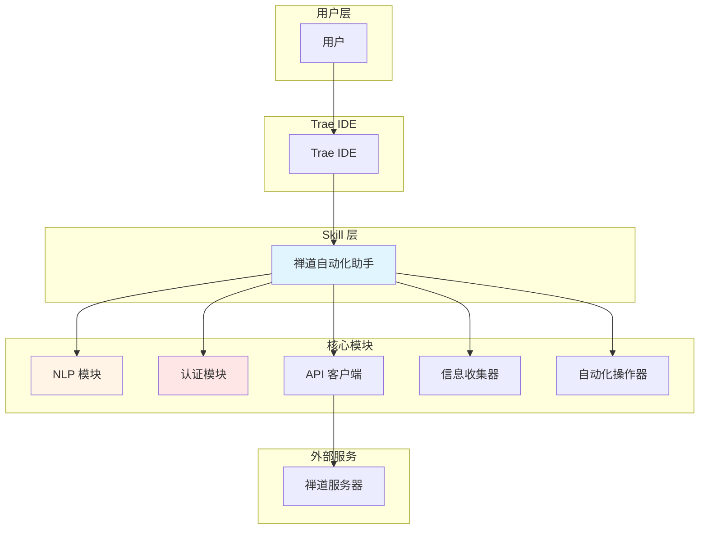
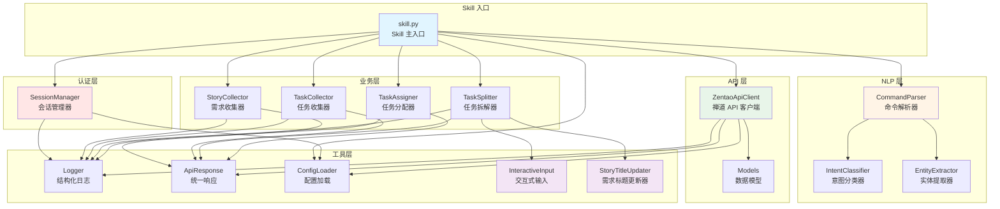
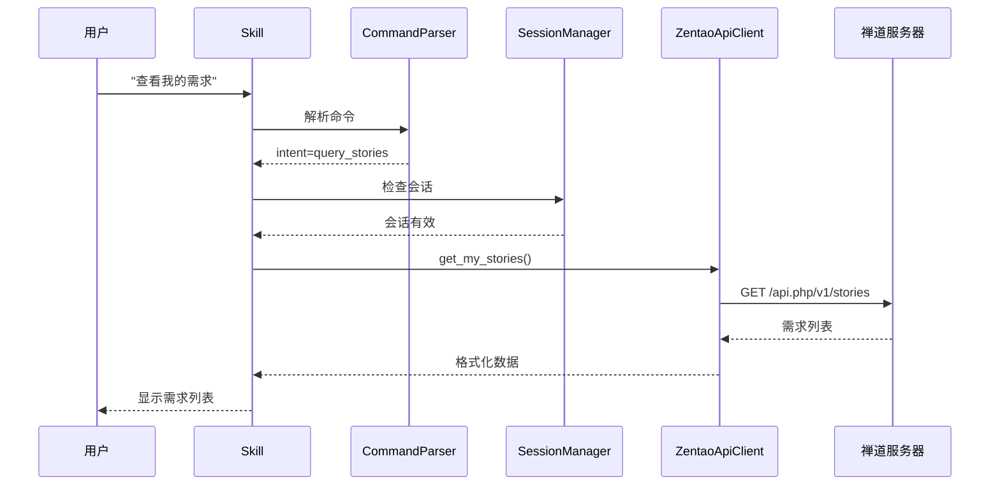
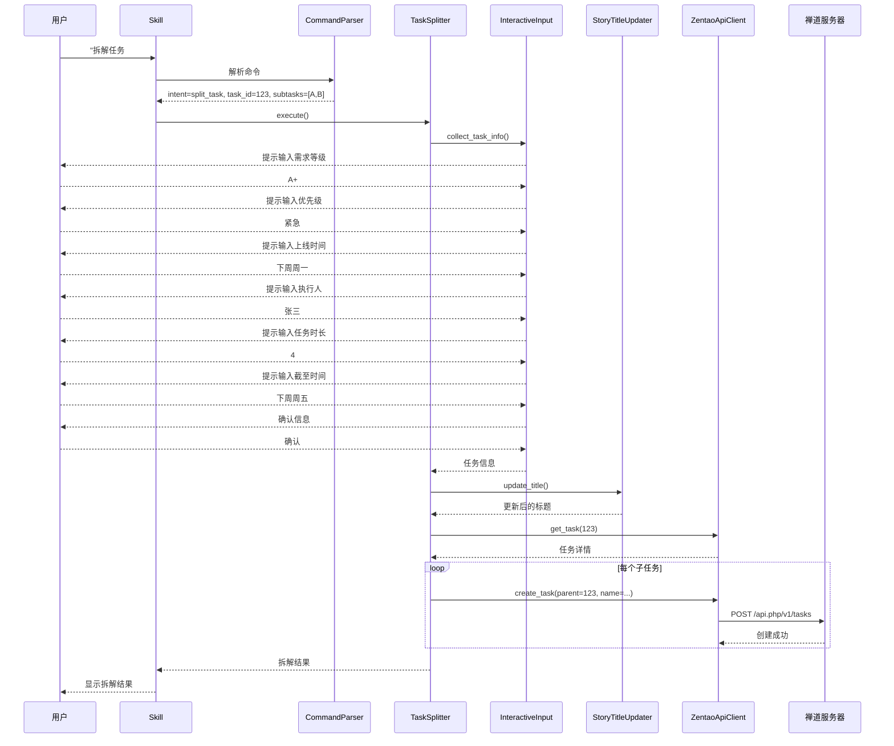
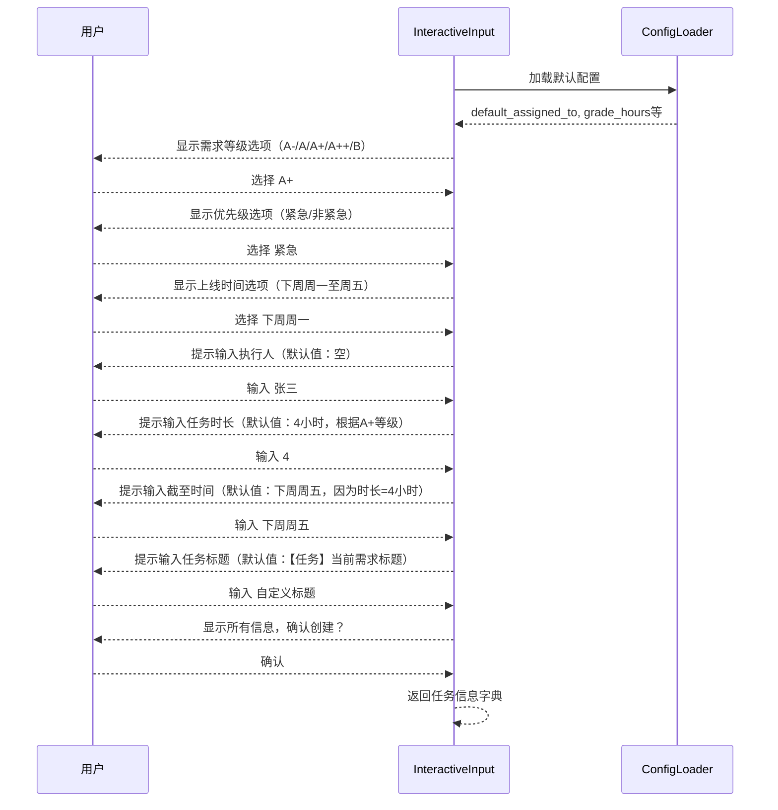

# 技术架构文档

## 1. 系统架构概览

ZTools 采用 **Skill-based Architecture**（基于技能的架构），通过 Trae Skill 机制提供模块化的自动化工具。


```mermaid
graph TB
    subgraph "用户层"
        User[用户]
    end

    subgraph "Trae IDE"
        Trae[Trae IDE]
    end

    subgraph "Skill 层"
        ZentaoHelper[禅道自动化助手]
    end

    subgraph "核心模块"
        NLP[NLP 模块]
        Auth[认证模块]
        API[API 客户端]
        Collectors[信息收集器]
        Automators[自动化操作器]
    end

    subgraph "外部服务"
        Zentao[禅道服务器]
    end

    User --> Trae
    Trae --> ZentaoHelper
    ZentaoHelper --> NLP
    ZentaoHelper --> Auth
    ZentaoHelper --> API
    ZentaoHelper --> Collectors
    ZentaoHelper --> Automators
    API --> Zentao

    style ZentaoHelper fill:#e1f5ff
    style NLP fill:#fff4e6
    style Auth fill:#ffe6e6
```

## 2. 技术栈

### 2.1 核心技术

| 层级 | 技术 | 版本 | 用途 |
|------|------|------|------|
| 语言 | Python | 3.13+ | 主要开发语言 |
| HTTP 客户端 | requests | 2.31+ | API 调用 |
| 配置管理 | PyYAML | 6.0+ | 配置文件解析 |
| 加密存储 | cryptography | 41.0+ | 会话加密 |
| 系统密钥环 | keyring | 24.0+ | 安全存储密钥 |

### 2.2 架构原则

1. **文档即真理**：代码只是文档的可执行版本
2. **上下文优先**：充分理解业务上下文后再编码
3. **防御性编程**：假设第三方服务不稳定
4. **防腐层设计**：统一转换外部 API 数据
5. **插件化扩展**：便于添加新功能

## 3. 模块设计

### 3.1 禅道自动化助手架构


```mermaid
graph TB
    subgraph "Skill 入口"
        SkillPy[skill.py<br/>Skill 主入口]
    end

    subgraph "NLP 层"
        CommandParser[CommandParser<br/>命令解析器]
        IntentClassifier[IntentClassifier<br/>意图分类器]
        EntityExtractor[EntityExtractor<br/>实体提取器]
    end

    subgraph "认证层"
        SessionManager[SessionManager<br/>会话管理器]
    end

    subgraph "API 层"
        ZentaoApiClient[ZentaoApiClient<br/>禅道 API 客户端]
        Models[Models<br/>数据模型]
    end

    subgraph "业务层"
        StoryCollector[StoryCollector<br/>需求收集器]
        TaskCollector[TaskCollector<br/>任务收集器]
        TaskSplitter[TaskSplitter<br/>任务拆解器]
        TaskAssigner[TaskAssigner<br/>任务分配器]
    end

    subgraph "工具层"
        Logger[Logger<br/>结构化日志]
        Response[ApiResponse<br/>统一响应]
        ConfigLoader[ConfigLoader<br/>配置加载]
        InteractiveInput[InteractiveInput<br/>交互式输入]
        StoryTitleUpdater[StoryTitleUpdater<br/>需求标题更新器]
    end

    SkillPy --> CommandParser
    CommandParser --> IntentClassifier
    CommandParser --> EntityExtractor

    SkillPy --> SessionManager
    SkillPy --> ZentaoApiClient
    SkillPy --> StoryCollector
    SkillPy --> TaskCollector
    SkillPy --> TaskSplitter
    SkillPy --> TaskAssigner

    SessionManager --> Logger
    ZentaoApiClient --> Models
    ZentaoApiClient --> Logger
    StoryCollector --> Logger
    TaskCollector --> Logger
    TaskSplitter --> Logger
    TaskAssigner --> Logger

    ZentaoApiClient --> Response
    StoryCollector --> Response
    TaskCollector --> Response
    TaskSplitter --> Response
    TaskAssigner --> Response

    SkillPy --> ConfigLoader
    SessionManager --> ConfigLoader
    ZentaoApiClient --> ConfigLoader

    TaskSplitter --> InteractiveInput
    TaskSplitter --> StoryTitleUpdater

    style SkillPy fill:#e1f5ff
    style CommandParser fill:#fff4e6
    style SessionManager fill:#ffe6e6
    style ZentaoApiClient fill:#e8f5e9
    style InteractiveInput fill:#f3e5f5
    style StoryTitleUpdater fill:#f3e5f5
```

### 3.2 核心模块说明

#### 3.2.1 NLP 模块
- **IntentClassifier**：基于关键词匹配的意图分类，预留 LLM API 扩展接口
- **EntityExtractor**：提取任务ID、用户名、子任务名称等实体
- **CommandParser**：组合意图和实体，生成结构化命令

#### 3.2.2 认证模块
- **SessionManager**：使用系统 keyring 加密存储会话，支持会话过期检测

#### 3.2.3 API 层
- **ZentaoApiClient**：统一的 API 调用接口，包含重试机制
- **Models**：定义领域模型（User, Story, Task），实现防腐层

#### 3.2.4 业务层
- **Collectors**：信息收集基类和具体实现（需求、任务）
- **Automators**：自动化操作基类和具体实现（任务拆解、分配）
  - **TaskSplitter**：支持交互式输入，自动更新需求标题
  - **TaskAssigner**：任务分配功能

#### 3.2.5 工具层
- **Logger**：符合 AGENTS 要求的结构化 JSON 日志
- **ApiResponse**：统一的 API 响应结构
- **ConfigLoader**：配置文件加载和管理
- **InteractiveInput**：交互式输入处理器，收集任务创建信息
- **StoryTitleUpdater**：需求标题更新器，自动格式化需求标题

## 4. 数据流

### 4.1 查询需求流程


```mermaid
sequenceDiagram
    participant User as 用户
    participant Skill as Skill
    participant Parser as CommandParser
    participant Auth as SessionManager
    participant API as ZentaoApiClient
    participant Zentao as 禅道服务器

    User->>Skill: "查看我的需求"
    Skill->>Parser: 解析命令
    Parser-->>Skill: intent=query_stories
    Skill->>Auth: 检查会话
    Auth-->>Skill: 会话有效
    Skill->>API: get_my_stories()
    API->>Zentao: GET /api.php/v1/stories
    Zentao-->>API: 需求列表
    API-->>Skill: 格式化数据
    Skill-->>User: 显示需求列表
```

### 4.2 任务拆解流程


```mermaid
sequenceDiagram
    participant User as 用户
    participant Skill as Skill
    participant Parser as CommandParser
    participant Splitter as TaskSplitter
    participant Input as InteractiveInput
    participant TitleUpdater as StoryTitleUpdater
    participant API as ZentaoApiClient
    participant Zentao as 禅道服务器

    User->>Skill: "拆解任务#123为A和B"
    Skill->>Parser: 解析命令
    Parser-->>Skill: intent=split_task, task_id=123, subtasks=[A,B]
    Skill->>Splitter: execute()
    
    Splitter->>Input: collect_task_info()
    Input-->>User: 提示输入需求等级
    User-->>Input: A+
    Input-->>User: 提示输入优先级
    User-->>Input: 紧急
    Input-->>User: 提示输入上线时间
    User-->>Input: 下周周一
    Input-->>User: 提示输入执行人
    User-->>Input: 张三
    Input-->>User: 提示输入任务时长
    User-->>Input: 4
    Input-->>User: 提示输入截至时间
    User-->>Input: 下周周五
    Input-->>User: 确认信息
    User-->>Input: 确认
    Input-->>Splitter: 任务信息
    
    Splitter->>TitleUpdater: update_title()
    TitleUpdater-->>Splitter: 更新后的标题
    
    Splitter->>API: get_task(123)
    API-->>Splitter: 任务详情
    
    loop 每个子任务
        Splitter->>API: create_task(parent=123, name=...)
        API->>Zentao: POST /api.php/v1/tasks
        Zentao-->>API: 创建成功
    end
    
    Splitter-->>Skill: 拆解结果
    Skill-->>User: 显示拆解结果
```

### 4.3 交互式输入流程


```mermaid
sequenceDiagram
    participant User as 用户
    participant Input as InteractiveInput
    participant Config as ConfigLoader

    Input->>Config: 加载默认配置
    Config-->>Input: default_assigned_to, grade_hours等
    
    Input-->>User: 显示需求等级选项（A-/A/A+/A++/B）
    User-->>Input: 选择 A+
    
    Input-->>User: 显示优先级选项（紧急/非紧急）
    User-->>Input: 选择 紧急
    
    Input-->>User: 显示上线时间选项（下周周一至周五）
    User-->>Input: 选择 下周周一
    
    Input-->>User: 提示输入执行人（默认值：空）
    User-->>Input: 输入 张三
    
    Input-->>User: 提示输入任务时长（默认值：4小时，根据A+等级）
    User-->>Input: 输入 4
    
    Input-->>User: 提示输入截至时间（默认值：下周周五，因为时长=4小时）
    User-->>Input: 输入 下周周五
    
    Input-->>User: 提示输入任务标题（默认值：【任务】当前需求标题）
    User-->>Input: 输入 自定义标题
    
    Input-->>User: 显示所有信息，确认创建？
    User-->>Input: 确认
    
    Input-->>Input: 返回任务信息字典
```

## 5. 安全设计

### 5.1 认证流程
1. 首次使用：交互式输入用户名和密码
2. 密码仅在内存中存在，不写入文件
3. 登录成功后，获取 Token 和 Cookies
4. 加密存储会话信息到系统 keyring
5. 后续使用自动加载会话

### 5.2 加密机制
- 使用 Fernet 对称加密
- 加密密钥存储在系统 keyring（Windows 凭据管理器）
- 会话文件包含过期时间，自动检测

### 5.3 API 安全
- 所有 API 调用使用 HTTPS（如服务器支持）
- Token 在请求头中传递
- 自动重试网络错误（502/503/504）

## 6. 扩展性设计

### 6.1 添加新意图
在 `IntentClassifier.INTENTS` 中添加新的意图和关键词。

### 6.2 添加新实体
在 `EntityExtractor` 中添加新的实体提取方法。

### 6.3 添加新自动化操作
1. 继承 `BaseAutomator`
2. 实现 `execute()` 方法
3. 在 `skill.py` 中注册

### 6.4 集成 LLM API
预留 LLM 接口，配置文件中设置：
```yaml
nlp:
  llm:
    enabled: true
    provider: "openai"
    api_key: "your-api-key"
    model: "gpt-4"
```

### 6.5 添加新 Skill
在 `.trae/skills/` 目录下创建新的 Skill：

```
.trae/skills/
├── zentao-helper/          # 现有 Skill
└── new-skill/              # 新 Skill
    ├── skill.py
    ├── SKILL.md
    ├── requirements.txt
    ├── config/
    │   └── settings.yaml
    └── src/
        └── ...
```

每个 Skill 独立管理依赖和配置，通过 Trae IDE 统一调用。

## 7. 部署架构

### 7.1 项目结构

```
ZTools/
├── .trae/                          # Trae Skill 目录
│   └── skills/
│       └── zentao-helper/          # 禅道自动化 Skill
│           ├── skill.py             # Skill 入口
│           ├── SKILL.md             # Skill 文档
│           ├── requirements.txt     # 依赖
│           ├── config/              # 配置
│           │   └── settings.yaml
│           └── src/                 # 源代码
│               ├── auth/
│               ├── zentao/
│               ├── nlp/
│               ├── collectors/
│               ├── automators/
│               └── utils/
│
├── docs/                            # 项目文档
│   ├── spec/                        # 需求规格
│   ├── design/                      # 设计文档
│   │   └── architecture.md
│   ├── troubleshooting/             # 问题排查指南
│   ├── changelog.md
│   └── current_status.md
│
├── scripts/                         # 运维脚本
│   ├── setup.sh                     # 初始化脚本（Linux/Mac）
│   ├── setup.ps1                    # 初始化脚本（Windows）
│   ├── verify_deployment.sh         # 部署验证（Linux/Mac）
│   └── verify_deployment.ps1        # 部署验证（Windows）
│
├── .cursorrules                     # AI 编码规范
├── AGENTS.md                        # 项目基本法
└── README.md                        # 项目入口
```

### 7.2 部署流程

1. **环境准备**
   - Python 3.13+
   - Trae IDE
   - Git

2. **安装步骤**
   ```bash
   git clone https://github.com/Zaxuk/Project-Z.git
   cd "Project Z/ZTools"
   ./scripts/setup.sh  # 或 setup.ps1（Windows）
   ```

3. **配置检查**
   ```bash
   ./scripts/verify_deployment.sh  # 或 verify_deployment.ps1（Windows）
   ```

4. **使用**
   在 Trae IDE 中直接使用自然语言指令调用 Skill。

## 8. 技术债务

- [ ] 完善单元测试覆盖率（目标 >80%）
- [ ] 添加集成测试
- [ ] 完善 API 错误处理和重试策略
- [ ] 优化 NLP 意图识别准确率
- [ ] 添加性能监控和日志分析

## 9. 架构决策记录 (ADR)

| ADR ID | 决策内容 | 日期 | 状态 |
|--------|----------|------|------|
| ADR-001 | 选择 Python 作为主要开发语言 | 2026-02-28 | ✅ 已采纳 |
| ADR-002 | 使用关键词匹配实现 NLP，预留 LLM 扩展 | 2026-02-28 | ✅ 已采纳 |
| ADR-003 | 使用系统 keyring 存储加密密钥 | 2026-02-28 | ✅ 已采纳 |
| ADR-004 | 采用 Trae Skill 架构，Skill 放在 .trae/skills/ 目录 | 2026-02-28 | ✅ 已采纳 |
| ADR-005 | 任务拆解支持交互式输入和自动标题更新 | 2026-03-03 | ✅ 已采纳 |

## 10. Skill 架构说明

### 10.1 为什么使用 Trae Skill 架构？

1. **模块化**：每个 Skill 独立开发和部署
2. **可扩展**：易于添加新功能
3. **自然语言交互**：用户通过自然语言调用，无需记忆命令
4. **IDE 集成**：与 Trae IDE 深度集成，提供流畅体验

### 10.2 Skill 目录放在 .trae/skills/ 下的原因

根据 Trae IDE 的 Skill 规范：
- Skill 必须放在 `.trae/skills/` 目录下
- 每个 Skill 是一个独立的 Python 包
- Trae IDE 自动识别并加载这些 Skill

### 10.3 多 Skill 管理

如果未来需要添加更多自动化工具：

```
.trae/skills/
├── zentao-helper/          # 禅道自动化
├── email-assistant/        # 邮件助手
├── calendar-helper/        # 日历助手
└── document-generator/     # 文档生成器
```

每个 Skill：
- 独立的依赖管理（requirements.txt）
- 独立的配置（config/settings.yaml）
- 独立的文档（SKILL.md）
- 共享项目级文档（docs/）

### 10.4 Skill 与项目的关系

- **项目级**（ZTools/）：
  - 整体架构文档
  - 开发规范（.cursorrules, AGENTS.md）
  - 运维脚本（scripts/）
  - 项目入口（README.md）

- **Skill 级**（.trae/skills/{skill-name}/）：
  - 具体功能实现
  - Skill 专属文档
  - 独立依赖
  - 独立配置

这种分层结构确保：
- 项目整体一致性
- Skill 之间松耦合
- 易于维护和扩展
